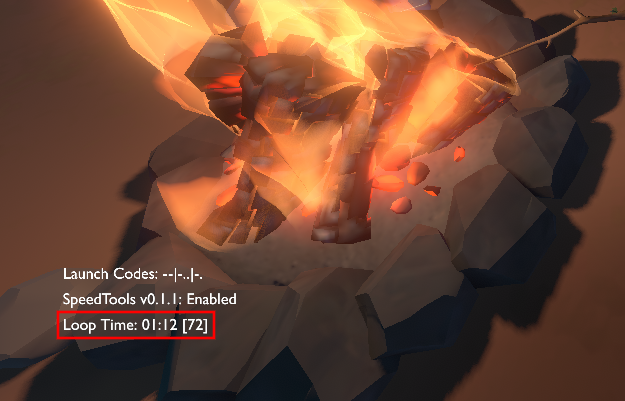

# SpeedTools by GrimLala

SpeedTools is a mod that was conceived to make speedrunning Outer Wilds more accessible.

Outer Wilds has a complex physics engine that calculates celestial orbits in real time. This and other game mechanics make certain aspects of the speedrun very time-sensitive and difficult to master. New runners may struggle to set up key timing windows to practice skips or ideal flight patterns.

We have devised a series of *practice states*, inspired by emulator save states, that use a combination of teleportation, time acceleration, and "cheats" to set up the player to practice different sections of the speedrun. For now, our practice states follow the [Normal Any%](https://www.speedrun.com/outer_wilds/guide/6oj7z) category, but we hope to expand to fully support other categories.

We owe a debt of inspiration to the very useful [Cheats Mod](https://github.com/PacificEngine/OW_CheatsMod), which should be compatible with our mod for those who wish to use both.

\- [grim](https://www.twitch.tv/grimsalad) & [Lala](https://www.twitch.tv/lordlala/)

## Installation
SpeedTools and its dependencies can be easily installed with the [Outer Wilds Mod Manager](https://outerwildsmods.com/mod-manager/):
1. Download the Mod Manager from the [Outer Wilds Mods](https://outerwildsmods.com/) website.
2. Use the Mod Manager to install `OWML`and `PacificEngine's Common Resources`.
3. Use the Mod Manager to install `SpeedTools` by `GrimLala`.

## Loop Timer
Once the Nomai statue has been activated in a new expedition, a *loop timer* will appear in the bottom left corner of the screen:

This has been included to help the player understand where they are in the supernova cycle. The timer can also be used to determine custom start times for practice states.

The timer sometimes persists on the title screen. We decided not to remove it, because this screen also experiences a 22-minute death of the universe.

## Helpful Toggles and Keys

| Key   | Description |
| :---: | --- |
`]` + `1` | Toggle Infinite Fuel
`]` + `6` | Toggle Endgame Tree Locator
`]` + `0` | Toggle Speedup (cancel with `ESC`)
`\` + `]` | Output Current State to OWML Console

Speedup is a fairly uncontrolled feature. The toggle is responsive on the title screen, but not so much in the actual game due to the computational load of all the physics calculations being carried out. We recommend spamming `ESC` to cancel speedup if you use it.

## Practice State

### Statue Skip

**Default key:** `\` + `1`

This state places the player inside the Timber Hearth Observatory, near the entrance so that the Nomai statue skip can be practiced. If the mask cutscene has already been triggered, then Hornfels is removed from the scene so as not to obstruct practice. Infinite fuel is enabled by default so that the skip movement may be practiced over and over.

### Twin Flight

**Default key:** `\` + `2`

This state mimics sleeping for 6:45 so that the player can practice flying to the Hourglass Twins to obtain the warp core.

Sleep is a mechanic that increases `Time.timeScale`, the scale at which time passes in the game. We increase this as much as the Unity engine allows so that the player does not have to wait through a slower sleep cycle to practice this flight path. The rate at which the game carries out physics computations is core-bound, so there is a limit to how quickly time can pass that depends on a user's system specs, but speeding up time this way is certainly faster than sleeping.

Going to sleep at the campfire takes about 5 seconds, so we actually need to speed up time until 6:50, or 410 seconds. This time can be adjusted in the settings, and the loop timer can be used to help choose a desired time.

The loop timer must be active for this practice state to work. This means that the Nomai statue cutscene must be triggered before this practice state can be called in a new expedition. When continuing an existing expedition, this state can be called at any point before the set time has passed, but not after.

### Bramble Entry

**Default key:** `\` + `3`

This state mimics warping out of the Ash Twin Project by 8:08 (488 seconds) to practice flying to Dark Bramble within an ideal time window. The player starts on the Ash Twin warp pad with a warp core in hand. We cannot mimic wedging the ship under the bridge between the towers, but the ship will be nearby for quick retrieval.

This practice state can be called at any point before the set time has passed, but not after.

### Vessel Activation

**Default key:** `\` + `4`

This state places the player just inside the Vessel with a warp core in hand. The player can practice inserting the core and entering the Eye coordinates, and then continue on to practice Vessel clip. Once the warp to the Eye has been complete, this state cannot be called again; but it can be called immediately after starting a new expedition.

### Vessel Clip

**Default key:** `\` + `5`

This state places the player inside the Vessel next to the navigation console with the warp core inserted (it's invisible, but it's there) and the Eye coordinates already entered. Vessel clip is ready. Once the warp to the Eye has been complete, this state cannot be called again; but it can be called immediately after starting a new expedition.

*Note: There seems to be some loading of the next scene happening in the background. If you are getting stuck in a black void and not getting fully warped, try waiting a little bit before triggering the warp.*

### Instrument Hunt

**Default key:** `\` + `6`

**Tree locator toggle:** `]` + `6`

This state places the player just above the loading zone for the Quantum Observatory so the final segment of the speedrun can be practiced.

You can make the player clone appear more quickly if you can find a cluster of three large trees, in a process described in [thestrangepie's Any% guide](https://www.speedrun.com/outer_wilds/guide/6oj7z). We have placed a bright orb (toggled with `]` + `6`) in the middle of this cluster to help new runners learn its location more easily.

## Custom Practice States

If there are specific sections of a run you would like to practice that are not covered by the above practice states, there is a way to create your own custom states. In the mod config menu you will find three custom states that you can configure to suit your needs.

*Note: Custom states do not currently support scene transitions, so some teleport destinations may not be accessible (e.g., the Eye of the Universe).*

### Custom Practice State Settings

| Setting   | Menu Name | Description
| :---: | --- | --- |
Trigger Key | Practice Custom *X* | The hotkey used to trigger the given practice state.
Start Time | Custom *X* Start Time | Number of seconds into the loop the state should advance time. Use 0 if the loop time is irrelevant.
Spacesuit Toggle | Custom *X* Spacesuit | Whether the player should have the space suit equipped.
Infinite Fuel Toggle | Custom *X* Infinite Fuel | Whether the player should have infinite fuel for the space suit. Useful for practicing sections that require a lot of flight. Can later be turned off once ready for more realistic practice runs.
Freeze Super Nova Toggle | Custom *X* Freeze Super Nova | Whether the supernova time loop should progress. Useful for repeated practice of a section where the loop time isn't important, allowing the state to be called and practiced repeatedly without a time limit.
Teleport Target | Custom *X* Teleport Target Body | The planet/body to teleport to; see **Getting Info for a Custom Practice State** below.
Teleport Position | Custom *X* Teleport Target Postion | The position on the target planet/body to teleport to; see **Getting Info for a Custom Practice State** below.

### Getting Info for a Custom Practice State

**Default key:** `\` + `]`

Custom states aren't very useful if you don't know when and where you want the player to be. To assist in gathering this information, a hotkey has been provided that will output the current loop time, current planet/body, and current position to the Mod Manager logs. Those values can then be used when configuring your custom practice states.

## Troubleshooting

Outer Wilds was not developed with the intention of supporting some of the disjointed warps and scene transitions that we've coded into our practice states. If you encounter an issue like getting stuck in a black void or immediately dying from collision, just try again. If the issue persists, try giving the game an extra second to load before you press the practice state button.

We haven't tested every scenario, so if you are having repeated issues, let us know! You can discuss the problem here on GitHub, or contact us through the Outer Wilds Modding community on Discord: `grimsalad#0004` & `LordLala#0052`.